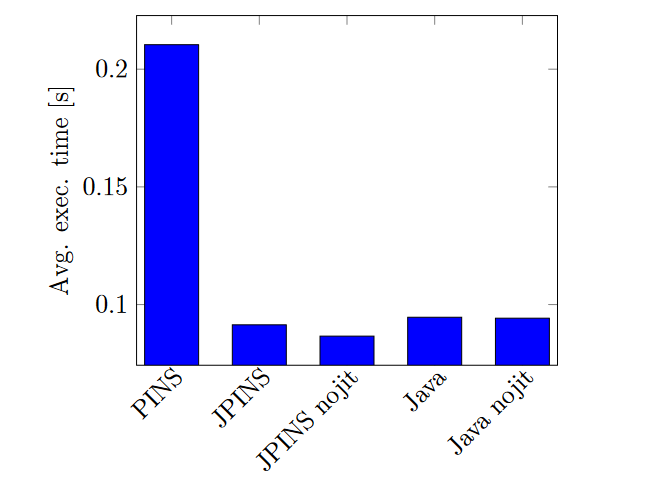
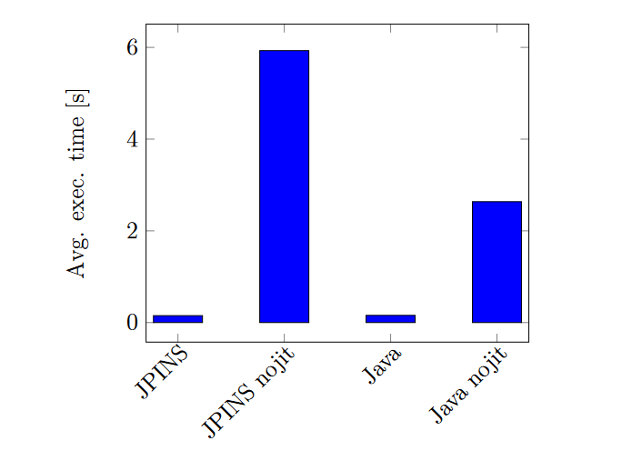
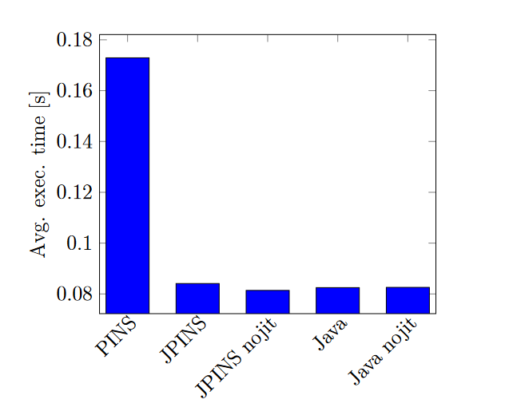
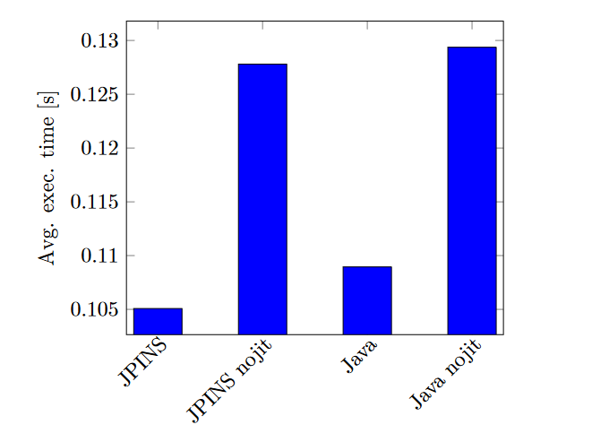
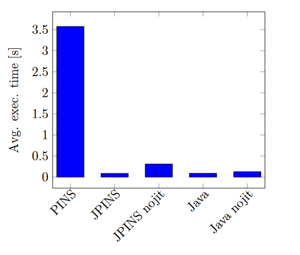

# PINS-JavaBytecode-Compiler
A PINS to Java bytecode compiler, created as part of my undergraduate diploma 
thesis.

---

## 1. Description 📰

This compiler is a part of my CS Undergraduate diploma thesis, in which
I attempt to expand the [PINS Compiler](https://github.com/LukaSveigl/PINS22-Compiler)
created as part of my Undergraduate course in **Compilers and Virtual machines**,
by changing the back-end compilation process to target the **Java Virtual Machine**,
instead of the educational PINS interpreter kindly provided by our professor.

---

## 2. Language specifications 📋

The PINS programming language is a simple, general-purpose
programming language created for educational purposes. The specification for the
language can be found in [PINS-specification-SLO.pdf](PINS-specification-SLO.pdf), and the grammar
for the language can be found in [PINS-grammar.txt](PINS-grammar.txt). Some examples of PINS
programs can be found in [prg](prg).

---

## 3. Building and running 🔨

To build this project, simply import the project into your IDE of choice. The project has 
been known to work on atleast Java 17. The project does not use any external libraries, 
so no additional setup is required. In the future an OS-agnostic Makefile will be added.

To run this project, simply run the 'Compiler' class, which is the entry point of the
application. The compiler takes multiple arguments, which are described below:

```
Usage: java Compiler [options]...
    The compiler options are:
        --src-file-name=<path>      Path to the source file to be compiled.
        --dst-file-name=<path>      Path to the destination file where the 
                                    compiled bytecode will be written. If the destination
                                    file is not specified, the compiled bytecode will be
                                    written to a class file with the same path as the
                                    source file, but with the '.class' extension.
        --target-phase=<phase>      To run the project use the phase 'all'.
        --comp-method=<method>      One of: 'interp', 'compile'. 'interp' will run the 
                                    interpreter, 'compile' will compile the source file
                                    to the file specified by the --dst-file-name option.

Example:
    java Compiler --src-file-name=prg/program.pins --target-phase=all --comp-method=compile
```


---

## 4. The compiler ▶️

The compiler is split into multiple standard phases. Descriptions for most of them 
can be found in the repository for the original compiler, available here:
[PINS22-Compiler](https://github.com/LukaSveigl/PINS22-Compiler)

The phases that are different from the original compiler are described below:

### 4.1 Reference analysis

This phase is responsible for analysing which variables are supposed to be passed around
as references. This is done by analysing the AST and looking for the following constructs:
- Nested function calls
- Prefix expressions with the reference operator

This is done because PINS22 supports nested functions and pointers, which are not supported
in the Java Virtual Machine, thus needing to be emulated. This is done by passing around
arrays of size 1, which contain the value of the variable.

The phase is implemented in the [refan](src/pins/phase/refan) directory.

### 4.2 Bytecode generation

This phase is responsible for generating the IR code representing the JVM instructions. It
traverses the ASTs and generates the appropriate IR sequences for each AST node. 

The phase is implemented in the [btcgen](src/pins/phase/btcgen) directory.

### 4.3 Bytecode emission

This phase is responsible for converting the IR code generated by the previous phase into
the actual bytecode and writing it to a file. This is done by looping over the IR code
of the methods, converting it to a corresponding sequence of bytes and writing it to a file.

The phase is implemented in the [btcemt](src/pins/phase/btcemt) directory.

---

## 5. Performance 📈

To test the performance of the compiler, a simple benchmark suite was created. The suite
consists of 3 algorithms, implemented in PINS22 and in Java. The algorithms were run using 
the following 3 implementations: interpreted PINS22, compiled PINS22 and Java. The 
performance of the algorithms was measured using a simple python script. The results of the
benchmark are explained in the following subchapters.

The performance test suite consists of the following algorithms:
- Quicksort algorithm
- Kadane's algorithm
- Fibonacci sequence

### 5.1 Quicksort algorithm

To test the performance of the quicksort algorithm, two different implementations were 
created. The first implementation tests the performance on an array of 20 constant integers
and the second implementation tests the performance on an array of 100000 random integers. The
implementations of the PINS22 version can be found in [prg/compiled-tests/quicksort.pins](prg/compiled-tests/quicksort.pins) 
and [prg/compiled-tests/bigQuicksort.pins](prg/compiled-tests/bigQuicksort.pins). The 
results are presented in the following graphs:



*Image 1: Performance of the quicksort algorithm on an array of 20 constant integers.*

<br>



*Image 2: Performance of the quicksort algorithm on an array of 100000 random integers.*

<br>

### 5.2 Kadane's algorithm

To test the performance of Kadane's algorithm, two different implementations were created.
The first implementation tests the performance on an array of 20 constant integers and the
second implementation tests the performance on an array of 100000 random integers. The
implementations of the PINS22 version can be found in [prg/compiled-tests/kadane.pins](prg/compiled-tests/kadane.pins)
and [prg/compiled-tests/bigKadane.pins](prg/compiled-tests/bigKadane.pins). The results
are presented in the following graphs:



*Image 3: Performance of Kadane's algorithm on an array of 20 constant integers.*

<br>



*Image 4: Performance of Kadane's algorithm on an array of 100000 random integers.*

<br>

### 5.3 Fibonacci sequence

The performance of the fibonacci sequence algorithm was tested by generating the 30. fibonacci
number. The implementations of the PINS22 version can be found in [prg/compiled-tests/fibonacci.pins](prg/compiled-tests/fibonacci.pins).
The results are presented in the following graph:



*Image 5: Performance of the fibonacci(30) algorithm.*

<br>

---

## 6. Future work 🔜

Additional work planned for the future:
- [ ] Add a Makefile for OS-agnostic compilation.
- [ ] Add a more comprehensive test suite.
- [ ] Add a more comprehensive benchmark suite.
- [ ] Fix bugs relating to pointers and nested functions.